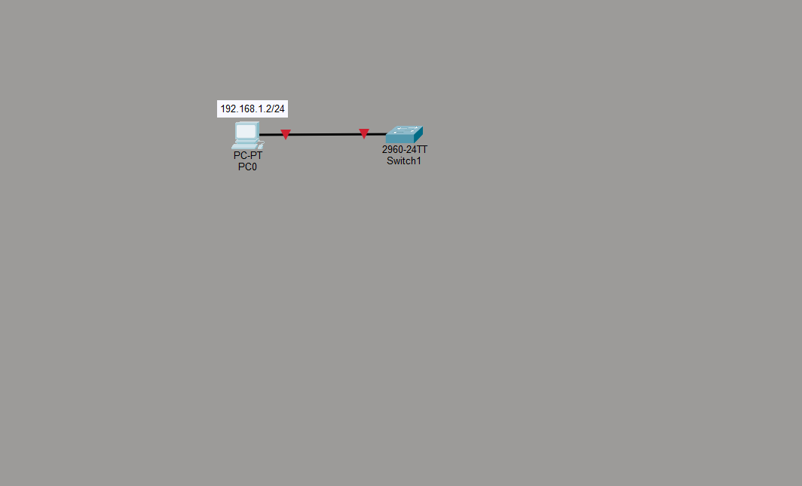
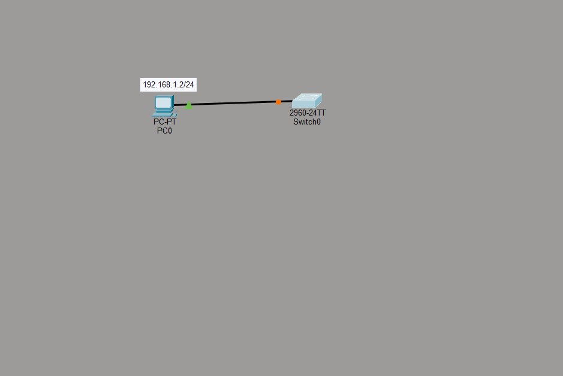
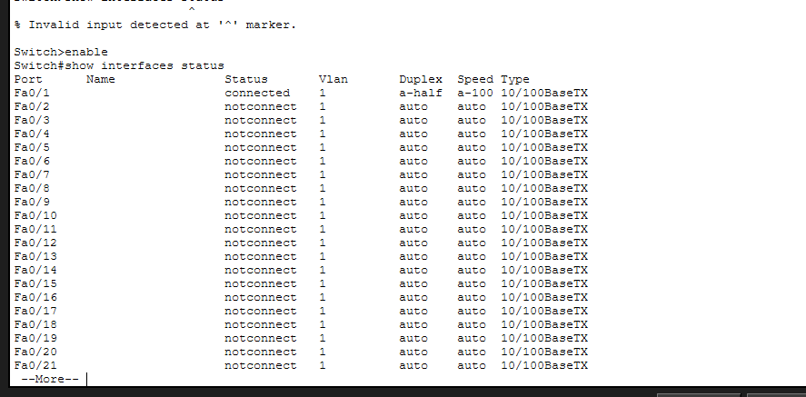
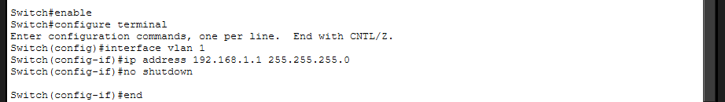
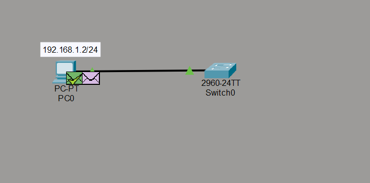

Troubleshooting and Resolution

PC0 was initially unable to establish connectivity with the switch. First, I checked the PC's network configuration using the ipconfig command. This confirmed that PC0 had the correct IPv4 address, 192.168.1.2, with subnet mask 255.255.255.0.



Next, I checked the physical connection and found that the original switch connection was not working. I removed the original switch and replaced it with a new 2960 switch, Switch0. I then connected PC0's FastEthernet0 interface to the switch's FastEthernet0/1 interface using a copper straight-through cable. The link indicators became active, confirming that the physical connection had been established.



After establishing the physical link, I configured a management IP address on the switch through its CLI. The following commands were used:



```
enable
configure terminal
interface vlan 1
ip address 192.168.1.1 255.255.255.0
no shutdown
end
```



I also configured PortFast on the PC-connected switch port:

```
configure terminal
interface fastethernet0/1
spanning-tree portfast
end
```

Finally, I tested connectivity from PC0 using:

```
ping 192.168.1.1
```

The first ping request timed out because the PC needed to resolve the switch's MAC address using ARP. However, the following three requests received replies from 192.168.1.1, confirming successful connectivity between PC0 and Switch0.


